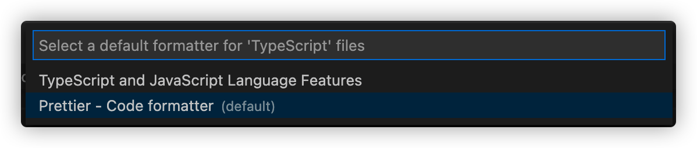

# 🚀 Getting Started

## Installation

Clone the repository

```bash
  git clone <git repo URI>
```

Switch to the repo folder

```bash
  cd <your Folder>
```

Install dependencies

```bash
  npm install
```

## 💎 The Package Features

- Application

  - 
    
    

- Development

  - 
    
    
    
    
    

<!-- - Utilities

  -  -->

- Database
  - 

### ✨ ESLint, Prettier :: Code Formatter

[Prettier](https://prettier.io/) is an opinionated code formatter.

[ESLint](https://eslint.org/), Find and fix problems in your JavaScript code

It enforces a consistent style by parsing your code and re-printing it with its own rules that take the maximum line length into account, wrapping code when necessary.

1. Install [VSCode](https://code.visualstudio.com/) Extension [Prettier](https://marketplace.visualstudio.com/items?itemName=esbenp.prettier-vscode), [ESLint](https://marketplace.visualstudio.com/items?itemName=dbaeumer.vscode-eslint)

2. `CMD` + `Shift` + `P` (Mac Os) or `Ctrl` + `Shift` + `P` (Windows)

3. Format Selection With

4. Configure Default Formatter...

5. Prettier - Code formatter



## 🗂 Code Structure

```bash
.
├── dist/ [the compiled output]
├── docs/ [openapi documentation]
├── src/ [the source code]/
│   ├── config/ [configuration files, including the env file variables]/
│   │   └── env.ts
│   ├── constants/ [constants]/
│   │   ├── common.constants.ts
│   │   └── HttpStatusCodes.ts
│   ├── database/ [database configuration (including sequelize instance and models initializations)]/
│   │   ├── sequelize/
│   │   │   ├── migrations/ [sequelize migrations]
│   │   │   ├── seeders/ [sequelize seeders]
│   │   │   └── sequelize-cli.js [sequelize cli configuration]
│   │   └── index.ts [database initialization]
│   ├── exceptions/ [custom exceptions]/
│   │   └── HttpException.ts
│   ├── interfaces/ [interfaces]/
│   │   ├── app/ [interfaces for the app and its business logic]
│   │   └── express/ [some app according custom interfaces for the framework]
│   ├── models/ [sequelize models]/
│   │   └── index.ts [exports all models which are then imported in the database/index.ts]
│   ├── server/
│   │   ├── controllers/ [controllers]
│   │   ├── helpers/ [app specific helpers]
│   │   ├── middlewares/ [middlewares]
│   │   ├── routes/ [routes]
│   │   ├── schemas/ [schemas (yup schemas for validations)]
│   │   ├── services/ [services]
│   │   └── server.ts [server initialization exports express App]
│   ├── tests/ [tests]/
│   │   ├── e2e/ [end to end tests]
│   │   └── -- other tests --
│   ├── utils/ [utils]/
│   │   └── logger.ts [logger]
│   └── main.ts [main bootstrap file]
├── .editorconfig
├── .env.example
├── .eslintignore
├── .eslintrc.js
├── .gitignore
├── jest.config.ts
├── nodemon.json
├── .nvmrc
├── package.json
├── package-lock.json
├── .prettierignore
└── .prettierrc
```

## .Env Schema

```bash
NODE_ENV='development' # development, production, test

# mysql config
DATABASE_HOST='127.0.0.1'
DATABASE_USER='root'
DATABASE_PASSWORD='root'
DATABASE_PORT=3306
DATABASE_SCHEMA='ts-express'
DATABASE_POOL_MAX=10
DATABASE_POOL_MIN=0
DATABASE_POOL_ACQUIRE=10000
DATABASE_POOL_IDLE=30000

#server config
PORT=3000

#jwt config
JWT_SECRET='MY_SERUPER_DUPER_SECURE_HARD_TO_GUESS_SECRET'
JWT_TOKEN_EXPIRE_TIME_IN_HOURS=576 #24 days
```

### Passing the Environment::

To pass an environment -->
`NODE_ENV={your environment}`

The app will pick corresponding .env file::<br />
eg.:: if you run `NODE_ENV=production npm start` then the `production.env` file will be used by the app...

| NOTE:: look for casing when passing the node environment

The database server is --> [MYSQL](https://dev.mysql.com/doc/refman/8.0/en/) RECOMMENDED version v8.0 or higher

The orm that is use --> [Sequelize V6](https://sequelize.org/docs/v6/other-topics/typescript/)

## NPM scripts

- `start`: starts the app with nodemon
- `start:prod`: runs the builded app in production mode
- `start:dev`: start the app in development mode with nodemon
- `clean`: removes the dist folder
- `clean:all`: removes the dist folder and node_modules
- `build`: builds the app with swc
- `build:tsc`: builds the app with tsc !!
- `lint`: runs eslint
- `lint:fix`: runs eslint with fix
- `format`: formats the code with prettier
- `ts:check`: checks the typescript code with tsc
- `db:migrate`: runs the migrations
- `db:migrate:undo`: undoes the last migration
- `db:migrate:undo:all`: undoes all migrations
- `db:migrate:status`: shows the migration status
- `db:migration:generate`: generates a new migration with the given name
- `db:seed:generate`: generates a new seed with the given name
- `db:seed`: runs the seed
- `db:seed:all`: runs all seeds
- `test`: runs all tests
- `test:e2e`: runs the e2e tests
